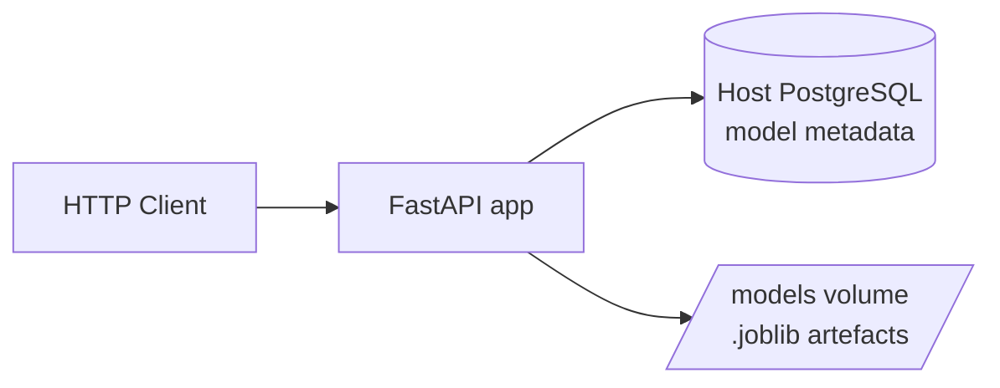

# Zenith-ops

[](https://github.com/victormorenob/Zenith-ops/actions/workflows/ci.yml)
[](https://www.python.org/downloads/)

### Problem

A trained scikit-learn model in a notebook does not serve traffic. It needs an HTTP API, versioned registry, and operational hooks—health probes, repeatable deploys—before it can run outside a dev environment.

### What Zenith-ops is

Zenith-ops is an ML serving API for scikit-learn models: register versions in PostgreSQL, run inference over HTTP, and operate the stack with liveness/readiness probes and automated CI/CD to a Hetzner VPS. The repo is a portfolio and learning project for MLOps engineering—architecture and tradeoffs are written down in specs and ADRs, not left implicit in the code.

### What's live in production today

The Phase 1 stack is deployed at [http://167.233.116.195:8000](http://167.233.116.195:8000): `POST /v1/predict` with optional idempotency keys, a PostgreSQL-backed model registry with `.joblib` artefacts on disk, `/health/live` and `/health/ready` probes, and push-to-`main` CI/CD to the VPS.

---

## At a glance

- **Phase:** 1 — MVP (API, registry, health, CI/CD)
- **Production:** [http://167.233.116.195:8000](http://167.233.116.195:8000)
- **Planned:** Phase 2 — MLflow, Prometheus/Grafana, drift detection

**In production today**

- `POST /v1/predict` — inference with optional idempotency keys and a 5s timeout
- Model registry — PostgreSQL metadata, `.joblib` artefacts on disk
- `/health/live` and `/health/ready` — readiness checks DB and model cache
- Push to `main` → CI (lint, type-check, tests) → CD deploy to VPS

---

## Architecture



Modular monolith: `zenith_ops/api/v1/` (HTTP + Pydantic), `zenith_ops/core/` (registry, domain), `zenith_ops/db/` (ORM), `zenith_ops/services/` (inference). Alembic migrations live in `src/db/migrations/` (separate from ORM). `core/` never imports from `api/`.

---

## Project structure

```
src/
├── db/migrations/          # Alembic
├── monitoring/.gitkeep     # Phase 2+, not implemented
├── training/.gitkeep       # Phase 2+, not implemented
└── zenith_ops/             # installable package
    ├── api/ (schemas/, v1/)
    ├── core/
    ├── db/                 # ORM only — no migrations here
    └── services/           # e.g. predictor.py (InferenceService)
```

---

## Engineering highlights

- **FastAPI + Pydantic v2** — async HTTP layer, structured error responses, OpenAPI at `/docs`
- **Modular monolith** — `zenith_ops/api/`, `core/`, `db/` (ORM), `services/`; Alembic in `src/db/migrations/`; business logic in `core/` and `services/` with no FastAPI imports
- **PostgreSQL registry** — SQLAlchemy 2.0 async, Alembic migrations, JSONB for metrics
- **Operations** — separate liveness/readiness probes, deploy runbook, post-deploy smoke checks on VPS
- **CI/CD** — GitHub Actions; multi-stage Docker build; GHCR images; SSH deploy runs migrations before app
- **Spec-driven work** — features scoped in `docs/specs/`; decisions recorded in ADRs

---

## Quick start

**Prerequisites:** Docker, [uv](https://docs.astral.sh/uv/), Git.

```bash
curl -LsSf https://astral.sh/uv/install.sh | sh   # install uv if needed

git clone https://github.com/victormorenob/Zenith-ops.git
cd Zenith-ops
just setup          # uv sync, pre-commit, copy .env.example → .env
just start          # PostgreSQL + migrate/seed + app (dev compose)
```

Edit `.env` if your local database URL differs from `.env.example` (default Postgres on host port `5433`).

| Surface | URL |
|---------|-----|
| API (local dev) | `http://localhost:8081` |
| Swagger | `http://localhost:8081/docs` |
| ReDoc | `http://localhost:8081/redoc` |

Stop the stack: `just stop`.

---

## Stack

| Layer | Choice | Rationale |
|-------|--------|-----------|
| Language | Python 3.12 | ML ecosystem standard |
| API | FastAPI (async) | Performance + auto-docs |
| Validation | Pydantic v2 | Runtime type safety |
| Database | PostgreSQL + asyncpg | Structured metadata and registry |
| Models | joblib + scikit-learn | Industry standard for serialisation |
| Testing | pytest | Universal Python tooling |

---

## API

| Method | Path | Description |
|--------|------|-------------|
| `GET` | `/health/live` | Liveness probe (process up) |
| `GET` | `/health/ready` | Readiness probe (DB + model cache) |
| `POST` | `/v1/predict` | Run inference (optional idempotency key) |
| `GET` | `/v1/models` | List registered model summaries |
| `GET` | `/v1/models/{model_id}` | Full metadata for one model version |
| `POST` | `/v1/models/register` | Register a new model version (`201`) |
| `PATCH` | `/v1/models/{model_id}/status` | Set `staging` / `production` / `archived` |

Interactive docs: `/docs` (Swagger), `/redoc` (ReDoc).

---

## Production

**Base URL:** [http://167.233.116.195:8000](http://167.233.116.195:8000)

```bash
curl -sf http://167.233.116.195:8000/health/live
curl -sf http://167.233.116.195:8000/health/ready
```

Deploy flow: push to `main` → GitHub Actions **CI** (tests, lint) → **CD** builds GHCR images and SSH-deploys to the Hetzner VPS (migrate then app).

Operator runbook: [docs/runbooks/deploy-production.md](docs/runbooks/deploy-production.md).

---

## Key design decisions

| Decision | Choice | Context |
|----------|--------|---------|
| Serving | Modular monolith | Microservices overhead doesn't pay for a single-node deployment |
| Model registry | PostgreSQL + filesystem | Metadata in tables, artefacts on disk. Object storage when scale demands it |
| Inference | Thread pool + timeout | 5s hard limit with `asyncio.wait_for`. Blocks neither the event loop nor the caller |
| Idempotency | In-memory key cache | Client-generated UUID deduplicates retries. Lost on restart — Redis later |
| Caching | Class-level dict | Models survive across requests. Future: LRU + TTL |

Full rationale: [docs/adr/DDD-001-arquitectura.md](docs/adr/DDD-001-arquitectura.md).

---

## Deployment

| Phase | Target | Orchestration |
|-------|--------|---------------|
| Development | Local | Docker Compose (`infra/docker/docker-compose.dev.yml`) |
| Production | Hetzner VPS | Host PostgreSQL 16 + Docker Compose (`docker-compose.prod.yml`) |
| Phase 3 (planned) | Hetzner VPS / cloud | k3s (Kubernetes) |

CI/CD via GitHub Actions (`.github/workflows/ci.yml`, `.github/workflows/cd.yml`).

---

## Documentation

- [Production deployment runbook](docs/runbooks/deploy-production.md)
- [Architecture decisions](docs/adr/DDD-001-arquitectura.md)
- API docs at `/docs` on any running instance
