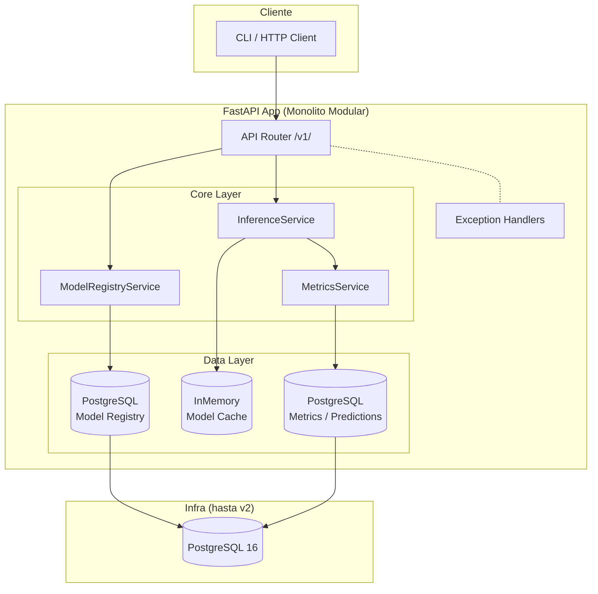
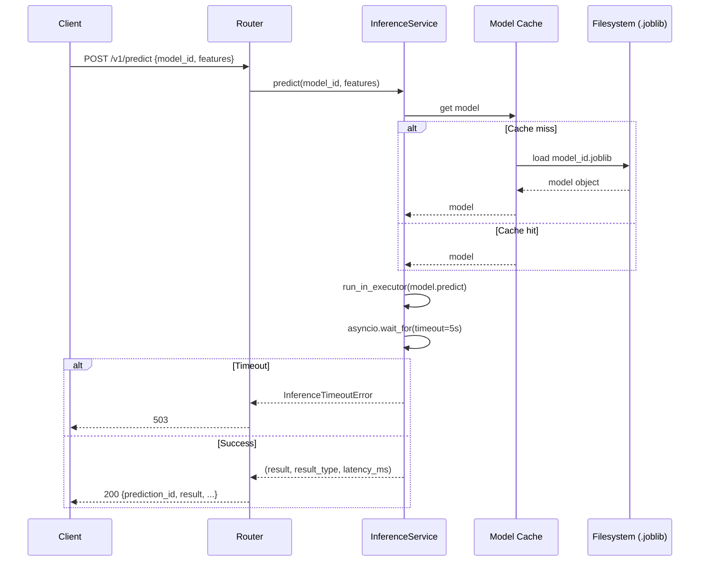

# DDD-001: Arquitectura de Zenith-ops

**Estado:** Aprobado
**Fecha:** 2026-06-10
**Autor:** Víctor Moreno
**Stack actual:** FastAPI, Python 3.12, Pydantic v2, SQLAlchemy async + asyncpg, Alembic, PostgreSQL

---

## 1. Resumen Ejecutivo de Decisiones

| # | Decisión | Elegido | Justificación (1 línea) |
|---|----------|---------|------------------------|
| A | Model Registry storage | PostgreSQL (SQLAlchemy async) | Ya tenemos PostgreSQL + asyncpg + Alembic funcionando; añadir S3 es overkill para 1 dev hasta v3 |
| B | Serving architecture | FastAPI monolítico con módulos | Microservicios duplican infra, deploy, y tests para 1 dev; la separación en módulos da el mismo aislamiento sin el costo |
| C | Drift Detection | Evidently + Great Expectations (Fase 2) | Ambos: GX para calidad de datos entrantes, Evidently para drift estadístico batch. Pospuestos hasta tener tráfico real y métricas históricas |
| D | Orquestación infra | Docker Compose + migration a k3s en v2 | Docker Compose funciona para 1 dev 7-10h; k3s en Hetzner es el salto correcto cuando necesitemos multi-servicio |
| E | Experiment Tracking | MLflow self-hosted (local) | MLflow se integra con Python/Local sin dependencias externas; W&B y Neptune son caros para portfolio individual |
| F | Observabilidad | Prometheus + Grafana + Loki | Stack estándar OSS, auto-hosteable en la misma VPS que la app, sin licencias, y es lo que se ve en empresa |
| G | IaC | Terraform | Estándar de la industria, provider Hetzner existe, HCL versiona infra; Pulumi añade complejidad para 1 dev sin ventaja real |

---

## 2. Arquitectura Propuesta

### 2.1 Diagrama de Componentes (v0 → v1)



### 2.2 Flujo de Datos Principal (POST /v1/predict)



### 2.3 Límites de Responsabilidad

| Módulo | Responsabilidad | No responsable de |
|--------|----------------|-------------------|
| `api/v1/` | Contratos HTTP, validación Pydantic, routing | Lógica de negocio, acceso a datos |
| `core/inference_service.py` | Carga de modelos, cacheo, ejecución de inferencia | Persistencia, serialización HTTP |
| `core/model_registry.py` | CRUD de modelos, versionado, estado | Ejecución de modelos, HTTP |
| `core/metrics.py` | Cálculo de métricas, drift detection | Almacenamiento, alerting |
| `core/exceptions.py` | Excepciones de dominio | Manejo HTTP (lo hace el exception handler) |
| `db/` | Modelos SQLAlchemy, migraciones Alembic | Lógica de negocio |

### 2.4 Interfaces entre Componentes

```
InferenceService.predict(model_id, features) → tuple[result, ResultType, latency_ms]
ModelRegistryService.get_model(model_id) → ModelMetadata
ModelRegistryService.list_models() → list[ModelMetadata]
MetricsService.record_prediction(model_id, latency, result_type)
```

### 2.5 Cómo Escala de v0 → v3

| Escala | Model Registry | Serving | Infra | Observabilidad |
|--------|---------------|---------|-------|---------------|
| **v0 (hoy)** | Archivos `.joblib` en `models/` | Monolítico, 1 proceso FastAPI | Docker Compose local | Logs structlog |
| **v1 (Fase 1-2)** | PostgreSQL (modelos + versiones) | Monolítico + pool workers | Docker Compose + PostgreSQL hosteado | Prometheus + Grafana local |
| **v2 (Fase 3)** | PostgreSQL + Object Storage para artefactos | Monolítico + workers background | k3s en Hetzner, 1-3 nodos | Prometheus + Grafana + Loki |
| **v3 (Empresa)** | PostgreSQL + S3/MinIO + catalog | Microservicios separados | k3s con HA, CI/CD GitOps | Stack completo + alerting |

---

## 3. Decisiones y Justificaciones

### A. Model Registry: PostgreSQL (SQLAlchemy async)

**Elegido:** PostgreSQL relacional con SQLAlchemy async

**Justificación:** Ya tenemos PostgreSQL con asyncpg y Alembic funcionando, probados en SPEC-001. El Model Registry v1 necesita metadatos relacionales (nombre, versión, estado, fecha, ruta del artefacto) — datos que encajan naturalmente en tablas normalizadas. Añadir MinIO/S3 ahora es infraestructura extra sin beneficio real cuando los modelos son `.joblib` de <50MB.

**Trade-off asumido:** Los artefactos binarios (.joblib) se guardan en disco/filesystem, no en la DB. Si los modelos crecen (>100MB), migraremos a Object Storage en v2.

**Riesgo si falla:** Si los modelos superan 500MB y tenemos cientos de versiones, el filesystem local se vuelve inmanejable. **Mitigación:** extraer a MinIO en v2.

### B. Serving: FastAPI monolítico modular

**Elegido:** Monolito con módulos bien delimitados (api/ core/ db/)

**Justificación:** 1 dev, 7-10h/semana. Cada microservicio añade overhead operativo que no justificamos hasta tener 2+ devs o necesidades de escalado independiente.

**Regla:** `core/` no importa de `api/`. `api/` solo importa de `core/`. Prohibición de imports entre paquetes del mismo nivel.

### C. Drift Detection: Evidently + Great Expectations (Fase 2)

**Elegido:** Ambos, pospuestos a Fase 2.

**Justificación:** No compiten — se complementan. **Great Expectations** valida calidad de datos (nulos, rangos, tipos). **Evidently AI** mide drift estadístico (PSI, KS, Jensen-Shannon). Ninguno es necesario hasta que haya tráfico real.

### D. Orquestación: Docker Compose → k3s en v2

**Elegido:** Docker Compose para v0-v1, migración a k3s en Hetzner en v2.

**Justificación:** Docker Compose funciona para 1 dev. k3s añade valor cuando necesitemos rolling updates, service discovery, y escalado horizontal.

### E. Experiment Tracking: MLflow self-hosted

**Elegido:** MLflow self-hosted (local)

**Justificación:** MLflow se integra con Python con `mlflow.start_run()`. Corre localmente sin servidor separado. W&B/Neptune cuestan dinero y dependen de cloud externo.

### F. Observabilidad: Prometheus + Grafana + Loki

**Elegido:** Stack OSS completo

**Justificación:** Prometheus scrapea métricas de la app, Grafana visualiza, Loki centraliza logs. Todo auto-hosteable, sin licencias. Es el stack que más pesa en una entrevista técnica.

### G. IaC: Terraform

**Elegido:** Terraform con provider hcloud (Hetzner)

**Justificación:** Estándar de la industria. Provider `hcloud` maduro. Versionar infra con HCL es exactamente lo que se espera ver en un portfolio de seniority.

---

## 4. Riesgos Críticos

| # | Riesgo | Prob | Impacto | Mitigación | Plan B |
|---|--------|------|---------|------------|--------|
| 1 | **Un solo developer**: 7-10h/semana no alcanza | Alta | Alto | Priorizar features por valor de portfolio | Recortar Fase 3 |
| 2 | **MLflow self-hosted** se vuelve un estorbo | Media | Medio | Evaluar si realmente lo necesitamos en Fase 1 | Reemplazar con scripts planos |
| 3 | **Prometheus compite por recursos** con la app | Media | Alto | Empezar con métricas en memoria, separar Prometheus a v2 | Grafana Cloud free tier |
| 4 | **El monolito crece sin control** | Alta | Alto | Scope Rules desde el día 1 | Refactor con extracción de servicios |
| 5 | **k3s learning curve** frena Fase 2 | Alta | Medio | Dedicar 2 semanas solo a k3s | Mantener Docker Compose para serving |

---

## 5. Hoja de Ruta Técnica

### Fase 1: Serving y Registry (Semanas 1-12)
| Semana | Hito | Estado |
|--------|------|--------|
| 1-2 | POST /v1/predict con modelo dummy | ✅ COMPLETED |
| 3-4 | Model Registry CRUD | 🔜 Próximo |
| 5-6 | Integración predict + registry | 📝 |
| 7-10 | Health checks, logging, idempotency | 📝 |
| 11-12 | Review y documentación | 📝 |

### Fase 2: Observabilidad (Semanas 13-22)
- Prometheus + Grafana + Loki
- Evidently + Great Expectations
- MLflow self-hosted

### Fase 3: Auto-retraining y Escalado (Semanas 23-32)
- Trigger de retrain automático
- k3s migration en Hetzner
- Terraform + GitOps

---

## Apéndice: Stack por Fase

| Componente | Hoy (v0.1) | Fase 1 (v1) | Fase 2 (v2) | Fase 3 (v3) |
|-----------|-----------|-------------|-------------|-------------|
| Backend | FastAPI async | FastAPI async | FastAPI async | FastAPI async |
| DB | PostgreSQL 16 | PostgreSQL 16 | PostgreSQL 16 | PostgreSQL 16 + MinIO |
| Model Registry | Filesystem | SQLAlchemy | + MinIO | + Catalog |
| Inference | Monolítico | Monolítico | + workers | Microservicio |
| Metrics | structlog | structlog | Prometheus + Grafana | + Loki |
| Drift | — | — | Evidently + GX | + Alerting |
| Experiment Tracking | — | — | MLflow local | MLflow server |
| Orquestación | Docker Compose | Docker Compose | Docker Compose | k3s + Terraform |
| CI/CD | — | GitHub Actions | + Build | + GitOps |
