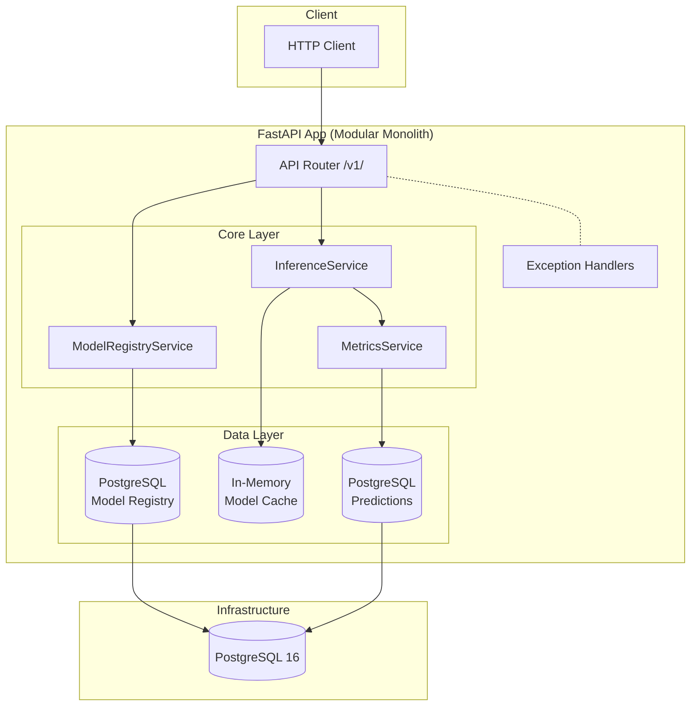
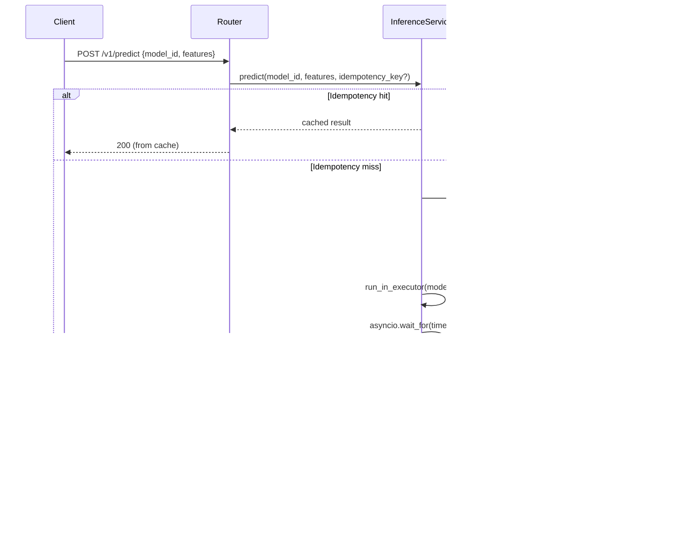

# DDD-001: Arquitectura de Zenith-ops

**Estado:** Aprobado
**Fecha:** 2026-06-10
**Autor:** Víctor Moreno
**Stack:** FastAPI, Python 3.12, Pydantic v2, SQLAlchemy async + asyncpg, Alembic, PostgreSQL

---

## 1. Resumen de Decisiones Arquitectónicas

| # | Decisión | Elección | Alternativas evaluadas |
|---|----------|----------|----------------------|
| A | Almacenamiento del Model Registry | PostgreSQL relacional | MongoDB, SQLite, archivos JSON |
| B | Arquitectura de Serving | Monolito modular | Microservicios, monolito sin estructura |
| C | Drift Detection | Evidently + Great Expectations (Fase 2) | Uno solo, ninguno |
| D | Orquestación | Docker Compose → k3s | Fly.io, AWS EKS |
| E | Experiment Tracking | MLflow self-hosted | W&B, Neptune |
| F | Observabilidad | Prometheus + Grafana + Loki | Stack cloud, Datadog |
| G | IaC | Terraform | Pulumi, Ansible |

---

## 2. Arquitectura

### 2.1 Diagrama de Componentes

```mermaid
graph TB
    subgraph "Client"
        CLI[HTTP Client]
    end

    subgraph "FastAPI App (Modular Monolith)"
        ROUTER[API Router /v1/]
        
        subgraph "Core Layer"
            INF[InferenceService]
            REG[ModelRegistryService]
            MET[MetricsService]
        end

        subgraph "Data Layer"
            MODELS_DB[(PostgreSQL\nModel Registry)]
            CACHE[(In-Memory\nModel Cache)]
            METRICS_DB[(PostgreSQL\nPredictions)]
        end

        EXC[Exception Handlers]
    end

    subgraph "Infrastructure"
        PG[(PostgreSQL 16)]
    end

    CLI --> ROUTER
    ROUTER --> INF
    ROUTER --> REG
    INF --> CACHE
    REG --> MODELS_DB
    INF --> MET
    MET --> METRICS_DB
    MODELS_DB --> PG
    METRICS_DB --> PG
    ROUTER -.- EXC
```

### 2.2 Flujo de Inferencia

```mermaid
sequenceDiagram
    participant C as Client
    participant R as Router
    participant IS as InferenceService
    participant CACHE as Model Cache
    participant FS as Filesystem
    
    C->>R: POST /v1/predict {model_id, features}
    R->>IS: predict(model_id, features, idempotency_key?)
    
    alt Idempotency hit
        IS-->>R: cached result
        R-->>C: 200 (from cache)
    else Idempotency miss
        IS->>CACHE: get model
        alt Cache miss
            CACHE->>FS: load .joblib
            FS-->>CACHE: model
        end
        IS->>IS: run_in_executor(model.predict)
        IS->>IS: asyncio.wait_for(timeout=5s)
        
        alt Timeout
            IS-->>R: InferenceTimeoutError
            R-->>C: 503
        else Success
            IS-->>R: (result, result_type, latency)
            R-->>C: 200 {prediction_id, result, ...}
        end
    end
```

### 2.3 Límites entre Capas

| Capa | Responsabilidad | Dependencias permitidas |
|------|----------------|------------------------|
| `api/v1/` | Contratos HTTP, validación Pydantic, routing | `core/`, Pydantic schemas |
| `core/` | Lógica de negocio, modelos, inferencia | `db/` models, librerías externas |
| `db/` | Modelos SQLAlchemy, migraciones Alembic | SQLAlchemy, alembic |

Regla fundamental: `core/` no importa de `api/`. `api/` solo usa `core/` para lógica.

### 2.4 Interfaces

| Interfaz | Firma |
|----------|-------|
| InferenceService.predict | `(model_id, features, idempotency_key?) → (result, ResultType, latency_ms)` |
| InferenceService._get_model | `(model_id) → loaded model` |
| InferenceService._load_model | `(model_id) → model from disk` |
| ModelRegistryService.get_model | `(model_id) → ModelMetadata` |
| ModelRegistryService.list_models | `() → list[ModelMetadata]` |

### 2.5 Evolución por Escala

| Escala | Model Registry | Serving | Infra | Observabilidad |
|--------|---------------|---------|-------|---------------|
| **v0** | filesystem (.joblib) | 1 proceso FastAPI | Docker Compose | structlog |
| **v1** | PostgreSQL + filesystem | FastAPI + thread pool | Docker Compose + PostgreSQL | Prometheus + Grafana |
| **v2** | + Object Storage | + background workers | k3s (Hetzner) | + Loki |
| **v3** | + Model Catalog | microservicios separados | k3s HA + GitOps | Stack completo + alerting |

---

## 3. Decisiones y Justificaciones

### A. Model Registry: PostgreSQL relacional

**Decisión:** Tablas normalizadas en PostgreSQL con SQLAlchemy async para metadatos de modelos (nombre, versión, estado, fecha). Artefactos binarios (.joblib) en filesystem.

**Alternativas evaluadas:**

| Alternativa | Motivo de descarte |
|-------------|-------------------|
| MongoDB | Los metadatos son estructurados, no documentos anidados. JSONB en PostgreSQL cubre los casos semi-estructurados sin perder restricciones relacionales |
| SQLite | Sin concurrencia real. Con requests concurrentes, serializa todo el acceso |
| Archivos JSON en disco | Sin integridad referencial, sin consultas, sin migraciones. Inviable para producción |

**Trade-offs:**
- Los artefactos .joblib viven en disco, no en la base de datos. Si el número de versiones crece, el filesystem se vuelve difícil de gestionar
- Migración a Object Storage (MinIO/S3) cuando los artefactos superen los 100MB

### B. Serving: Monolito modular

**Decisión:** Una aplicación FastAPI con separación estricta de paquetes (api/, core/, db/).

**Alternativas evaluadas:**

| Alternativa | Motivo de descarte |
|-------------|-------------------|
| Microservicios | Overhead operacional (N Dockerfiles, CI/CD, service discovery) que no se justifica para un solo nodo de despliegue |
| Monolito sin estructura | El código tiende a mezclar responsabilidades, impidiendo testeo aislado y extracción futura de servicios |

**Regla de alcance:** Cada módulo tiene una responsabilidad única. Si un módulo supera las 400 líneas sin poder descomponerse, se extrae. Si un dominio requiere escalado independiente, se convierte en microservicio.

### C. Drift Detection: Evidently + Great Expectations

**Decisión:** Ambos, implementados en Fase 2.

**Justificación:** No son intercambiables. Great Expectations valida calidad de datos entrantes (nulos, rangos, tipos). Evidently AI mide drift distribucional (PSI, KS, Jensen-Shannon). Implementar ambos desde el inicio añade complejidad sin datos históricos que justifiquen el drift.

### D. Orquestación: Docker Compose → k3s

**Decisión:** Docker Compose para desarrollo local, migración a k3s en Hetzner para producción.

**Alternativas evaluadas:**

| Alternativa | Motivo de descarte |
|-------------|-------------------|
| Fly.io | No expone conceptos de Kubernetes (pods, services, probes). No prepara para operaciones reales |
| AWS EKS | Costo elevado (~70€/mínimo) para un entorno de un solo nodo. k3s en Hetzner cuesta ~4€/mes |

### E. Experiment Tracking: MLflow self-hosted

**Decisión:** MLflow open source, servidor local.

**Alternativas evaluadas:**

| Alternativa | Motivo de descarte |
|-------------|-------------------|
| W&B | ~50$/user/mes. Dependencia de cloud externo |
| Neptune | ~50$/user/mes. Dependencia de cloud externo |

### F. Observabilidad: Prometheus + Grafana + Loki

**Decisión:** Stack OSS completo, auto-hosteable.

**Justificación:** Stack de métricas (Prometheus), dashboards (Grafana), y logs (Loki) en un mismo ecosistema. Sin licencias, sin límites de retention, sin dependencia externa.

### G. IaC: Terraform

**Decisión:** Terraform con provider hcloud (Hetzner).

**Alternativas evaluadas:**

| Alternativa | Motivo de descarte |
|-------------|-------------------|
| Pulumi (Python) | Más cómodo para un equipo Python, pero Terraform es el estándar de la industria. HCL versiona infraestructura de forma declarativa |
| Ansible | Imperativo, no diseñado para gestión de estado de infraestructura |

---

## 4. Riesgos

| # | Riesgo | Probabilidad | Impacto | Mitigación |
|---|--------|-------------|---------|------------|
| 1 | El monolito crece sin mantener la separación de capas | Media | Alto | Scope Rules en cada módulo. Refactor con extracción si se violan |
| 2 | MLflow se vuelve un servicio más que gestionar | Media | Medio | Evaluar si el valor de tracking justifica el mantenimiento |
| 3 | k3s añade complejidad operativa (networking, storage, upgrades) | Alta | Alto | Documentación de runbooks antes de la migración |
| 4 | El cache de modelos en memoria crece sin límite | Baja | Medio | LRU cache con maxsize configurable en próxima iteración |

---

## 5. Stack por Iteración

| Componente | v0.1 | v1 | v2 | v3 |
|-----------|------|----|----|----|
| Backend | FastAPI async | FastAPI async | FastAPI async | FastAPI async |
| DB | PostgreSQL 16 | PostgreSQL 16 | PostgreSQL 16 | + MinIO |
| Model Registry | Filesystem | SQLAlchemy | + MinIO | + Catalog |
| Inference | Monolítico | Monolítico | + workers | Microservicio |
| Logging | structlog | structlog | + Loki | + Loki |
| Metrics | — | Prometheus + Grafana | + Alerting | + Alerting |
| Drift | — | — | Evidently + GX | + Auto-remediation |
| Experiment Tracking | — | MLflow | MLflow server | MLflow server |
| Orquestación | Docker Compose | Docker Compose | k3s | k3s + GitOps |
| CI/CD | — | GitHub Actions | + Build | + GitOps |
