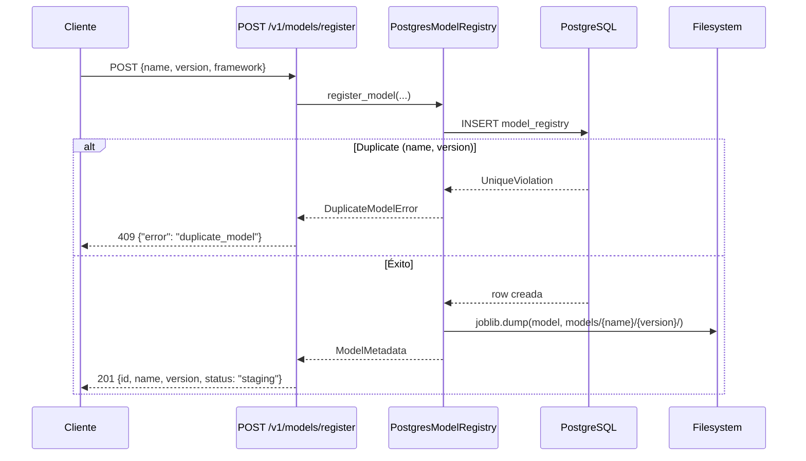
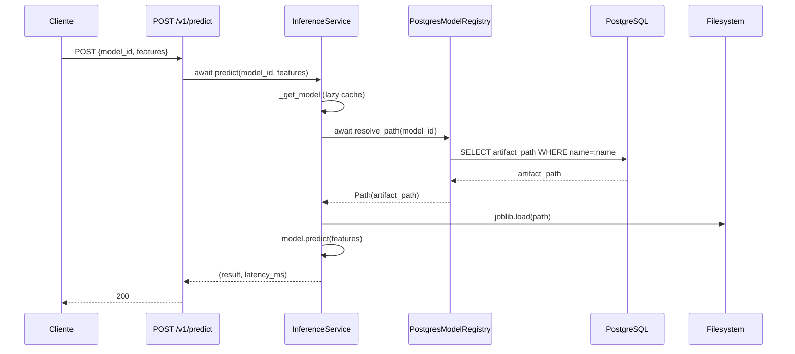

# Design: Model Registry — Migración a PostgreSQL

## Enfoque Técnico

Migración del Model Registry de file-scanning a PostgreSQL en 5 fases secuenciales. El Protocol `ModelRegistry` pasa a `async def` pero se mantiene read-only; las escrituras (`register_model`, `update_status`) viven en `PostgresModelRegistry`. Los artifacts `.joblib` permanecen en disco referenciados por `artifact_path` (TEXT), no BYTEA.

Cada fase produce un commit verificable: tests pasan, mypy 0 errores, cobertura ≥70%.

## Decisiones de Arquitectura

| Decisión | Opción | Alternativas | Rationale |
|----------|--------|--------------|-----------|
| Protocol async | 3 métodos como `async def` | Mantener sync con `run_sync()` | El codebase ya es async (FastAPI, SQLAlchemy async). `InferenceService._load_model` se refactoriza en la misma fase |
| Write methods | En `PostgresModelRegistry`, no en Protocol | Añadir al Protocol con stubs | Protocol read-only respeta SRP. `InferenceService` solo necesita `resolve_path`/`get_model` |
| artifact storage | `artifact_path` TEXT → disco | BYTEA en DB | Modelos ~100MB+ degradarían backups. Filesystem es óptimo para blobs grandes |
| Status | `staging`, `production`, `archived` | `active`, `staging`, `archived` | Alineado con ciclo de vida MLOps. `active` → `production` |
| GET compat | URL `{model_id}` → lookup por `name` | UUID en URL | No rompe clientes existentes que usan `iris-classifier` como ID |
| Uniqueness | `(name, version)` → 409 | Sin constraint | Identificador natural de una versión de modelo |
| `FileBasedModelRegistry` | Mantener, docstring deprecated | Eliminar ya | Útil para tests unitarios sin DB y como referencia |

## Diagramas de Flujo

### Registro de modelo



### Predicción con resolve_path async



## Cambios por Fase

### Fase A: Foundation
| Archivo | Acción | Descripción |
|---------|--------|-------------|
| `.env` | Modificar | `postgres:postgres@localhost:5433/ZenithOpsDatabase` |
| `db/models/model_registry.py` | Crear | `ModelRegistryEntry` con UUID PK, (name, version) UNIQUE, JSONB |
| `db/models/prediction_metadata.py` | Crear | `PredictionMetadata` con request_id UNIQUE, FK→model_registry |
| `db/models/__init__.py` | Modificar | Exportar nuevos modelos |
| `db/migrations/versions/` | Crear | `alembic revision --autogenerate` (ambas tablas) |
| `core/exceptions.py` | Modificar | Añadir `DuplicateModelError` |

### Fase B: PostgresModelRegistry
| Archivo | Acción | Descripción |
|---------|--------|-------------|
| `core/model_registry.py` | Modificar | Protocol→async def; FileBased deprecated docstring |
| `core/model_registry_db.py` | Crear | `PostgresModelRegistry`: 3 protocol methods + register + update_status |

### Fase C: API Wiring
| Archivo | Acción | Descripción |
|---------|--------|-------------|
| `api/v1/schemas/models.py` | Crear | `RegisterModelRequest`, `UpdateStatusRequest`, `ModelResponse` |
| `api/v1/models.py` | Modificar | Async Depends a PostgresModelRegistry; POST+PATCH endpoints |
| `zenith_ops/__init__.py` | Modificar | Handler para `DuplicateModelError` → 409 |

### Fase D: InferenceService
| Archivo | Acción | Descripción |
|---------|--------|-------------|
| `services/predictor.py` | Modificar | `_load_model` async, `_registry` default → PostgresModelRegistry |
| `core/model_registry_db.py` | Modificar | Añadir `log_prediction()` para prediction_metadata (best-effort) |

### Fase E: Seed + Tests
| Archivo | Acción | Descripción |
|---------|--------|-------------|
| `scripts/generate_dummy_model.py` | Modificar | Insertar row en DB + .joblib en disco |
| `tests/unit/test_postgres_model_registry.py` | Crear | Mock AsyncSession, test CRUD |
| `tests/integration/test_model_registry.py` | Modificar | DB-backed endpoint tests con TestClient |

## Interfaces / Contratos

### Protocolo actualizado
```python
class ModelRegistry(Protocol):
    async def list_models(self) -> list[ModelSummary]: ...
    async def get_model(self, model_id: str) -> ModelMetadata: ...
    async def resolve_path(self, model_id: str) -> Path: ...
```

### PostgresModelRegistry
```python
class PostgresModelRegistry:
    def __init__(self, session_factory: async_sessionmaker[AsyncSession]):
        self._session_factory = session_factory

    # Protocol
    async def list_models(self) -> list[ModelSummary]: ...
    async def get_model(self, model_id: str) -> ModelMetadata: ...
    async def resolve_path(self, model_id: str) -> Path: ...

    # Write
    async def register_model(self, request: RegisterModelRequest) -> ModelMetadata: ...
    async def update_status(self, model_uuid: str, status: str) -> ModelMetadata: ...

    # Prediction metadata (best-effort)
    async def log_prediction(self, *, model_id: str, request_id: UUID,
                             result, result_type, latency_ms, error: str | None) -> None: ...
```

### DI factory
```python
async def get_registry() -> PostgresModelRegistry:
    return PostgresModelRegistry(async_session_factory)
```

## Estrategia de Testing

| Capa | Qué probar | Cómo |
|------|-----------|------|
| Unit | PostgresModelRegistry CRUD con mock | `AsyncMock` para `session.execute`, `session.commit` |
| Unit | Duplicate → DuplicateModelError | Mock `IntegrityError` con `UniqueViolation` |
| Unit | PredictionMetadata best-effort | Mock session lanza excepción → no propaga |
| Unit | FileBased (sync) sigue funcionando | Tests existentes con `tmp_path` |
| Integration | API endpoints completos | TestClient + PostgreSQL en docker-compose |
| Integration | Ciclo register → predict → status → list | DB + FS reales |

## Migración / Rollout

No hay datos legacy que migrar (FileBasedRegistry se mantiene como referencia). La primera migración crea ambas tablas desde cero. Rollback: `git revert` + `alembic downgrade -1`.

**Delivery**: 5 fases = 5 PRs chained. Cada fase es verificable independientemente y cabe en ~300 líneas.

## Preguntas Abiertas

- [x] `latency_ms` → **FLOAT**. El código actual ya devuelve FLOAT de `time.monotonic()`. Cambiar a INTEGER perdería precisión sin beneficio.
- [x] `updated_at` → **Incluir** en `model_registry` como columna opcional auto-gestionada.
