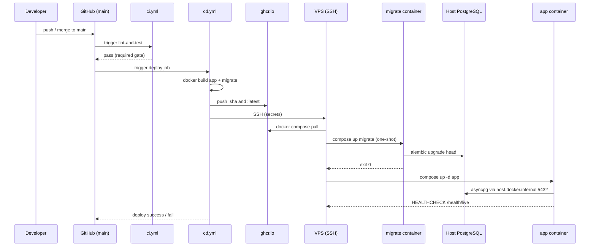

# Design: Production Docker Deployment

## Technical Approach

VPS (Hetzner) runs PostgreSQL 16 natively via `apt`; only **migrate** (one-shot Alembic) and **app** (uvicorn) run in Docker. Prod compose mirrors dev patterns (`depends_on: completed_successfully`, non-root images) but drops containerized PG, dev reload, and init/seed automation. CD builds multi-stage images, pushes to GHCR with SHA + `latest`, SSH-deploys on `main` push. See ADR-009 for host-PG rationale.

## Architecture Decisions


| Decision             | Choice                                               | Alternatives                                      | Rationale                                                                   |
| -------------------- | ---------------------------------------------------- | ------------------------------------------------- | --------------------------------------------------------------------------- |
| PostgreSQL placement | Host `apt` PG 16                                     | PG in Docker; managed DB                          | DDD-001 defers k3s; host PG = durable data, simpler ops, no volume coupling |
| App→DB networking    | `host.docker.internal` + `extra_hosts: host-gateway` | Bridge IP in `DATABASE_URL`; `network_mode: host` | Stable hostname across redeploys; `host-gateway` fixes Linux gap            |
| Migrations           | One-shot `migrate` service                           | Init container with seed; manual SSH alembic      | Separates schema from bootstrap; seed is one-time manual (runbook)          |
| Image reuse          | `infra/docker/Dockerfile` for app                    | Separate prod Dockerfile                          | Same multi-stage, non-root runtime; prod = compose env + HEALTHCHECK        |
| CD tagging           | Deploy pin `:${{ github.sha }}`; also push `:latest` | `latest` only                                     | SHA = reproducible rollback; `latest` = operator convenience                |
| Logging              | `LOG_FORMAT=json` in prod compose                    | Code default change                               | `logging_config.py` already supports JSON; no code change                   |


## Deploy Flow




## Host PostgreSQL Networking

```
┌──────────────── VPS (Hetzner) ────────────────────────────────┐
│  postgresql@16 (apt)  listen :5432                            │
│    listen_addresses = 'localhost,<host-private-ip>'           │
│    pg_hba.conf: host docker0 172.17.0.0/16 scram-sha-256      │
│                                                                 │
│  ┌──────── docker bridge (172.17.0.0/16) ────────┐             │
│  │  app ──► host.docker.internal:5432 ───────────┼──► PG      │
│  │  migrate (one-shot) ──────────────────────────┘             │
│  └─────────────────────────────────────────────────────────────┘
└─────────────────────────────────────────────────────────────────┘
```


| Setting             | Value                                                                 | Notes                                     |
| ------------------- | --------------------------------------------------------------------- | ----------------------------------------- |
| `listen_addresses`  | `'localhost'` + VPS private IP                                        | Avoid `*`; bind only needed interfaces    |
| `pg_hba.conf`       | `host ZenithOpsDatabase zenith <bridge-cidr>/16 scram-sha-256`        | Verify CIDR via runbook (`docker network inspect bridge`); typical `172.17.0.0/16` on Hetzner — **not pinned in compose** |
| Docker              | `extra_hosts: ["host.docker.internal:host-gateway"]` on app + migrate | Required on Linux                         |
| `DATABASE_URL` host | `host.docker.internal`                                                | Port `5432` (host native, not dev `5433`) |


Firewall: allow `5432` only from `docker0` / bridge — not public internet.

## GHCR + SSH CD


| Item            | Design                                                                                                                                 |
| --------------- | -------------------------------------------------------------------------------------------------------------------------------------- |
| Registry        | `ghcr.io/<owner>/zenith-ops-app`, `ghcr.io/<owner>/zenith-ops-migrate`                                                                 |
| Auth (CI)       | `GITHUB_TOKEN` with `packages: write`                                                                                                  |
| Auth (VPS pull) | **None** — images are **public** on GHCR; `docker pull` works without login. If switched to private later: PAT with `read:packages` via `docker login ghcr.io` on VPS |
| Trigger         | `push` to `main` after CI green (`workflow_run` or `needs` via reusable workflow)                                                      |
| Build           | `docker/build-push-action`; context repo root; dockerfiles under `infra/docker/`                                                       |
| Tags            | `:${{ github.sha }}` (deploy), `:latest` (cache/convenience)                                                                           |
| Deploy          | `appleboy/ssh-action`: `cd /opt/zenith-ops && IMAGE_TAG=$SHA docker compose -f infra/docker/docker-compose.prod.yml pull && ... up -d` |
| Timeout         | `timeout-minutes: 15` on deploy job                                                                                                    |


**GitHub Secrets**


| Secret        | Purpose                                         |
| ------------- | ----------------------------------------------- |
| `VPS_HOST`    | Hetzner IP or hostname                          |
| `VPS_USER`    | Deploy user (non-root + docker group)           |
| `VPS_SSH_KEY` | Private key for SSH                             |
| `GHCR_TOKEN`  | **Not required** — public images. Only if images are made private: PAT `read:packages` for VPS `docker login` |


VPS layout: `/opt/zenith-ops/` — `docker-compose.prod.yml`, `.env` (not in git), `models/` volume mount.

## Environment Variables Matrix


| Variable       | Dev (compose.dev)                     | Prod (VPS `.env` + compose.prod)  |
| -------------- | ------------------------------------- | --------------------------------- |
| `DATABASE_URL` | `@postgres:5432` (mapped `5433` host) | `@host.docker.internal:5432`      |
| `ENVIRONMENT`  | `development`                         | `production`                      |
| `LOG_LEVEL`    | `INFO`                                | `INFO` (or `WARNING`)             |
| `LOG_FORMAT`   | unset → console                       | `json`                            |
| `SECRET_KEY`   | placeholder                           | strong random (VPS-only)          |
| `IMAGE_TAG`    | n/a (local build)                     | `${{ github.sha }}` via CD        |
| PG credentials | `postgres/postgres`                   | dedicated `zenith` user (runbook) |


Compose prod: `env_file: .env`; never bake secrets into images.

## Migration / Bootstrap Sequence


| Phase             | Actor             | Action                                                                                                                            |
| ----------------- | ----------------- | --------------------------------------------------------------------------------------------------------------------------------- |
| Cold start (once) | Operator          | `apt install postgresql-16`; create DB/user; configure `pg_hba` + `listen_addresses`                                              |
| Cold start (once) | Operator          | Copy `.env.example` → `.env`; set prod values                                                                                     |
| Cold start (once) | Operator          | **Manual seed**: `docker compose run --rm app` or host `uv run python scripts/generate_dummy_model.py` — **not** in migrate image |
| Every deploy      | `migrate` service | `alembic upgrade head`; exit 0                                                                                                    |
| Every deploy      | `app` service     | Starts after `migrate: condition: service_completed_successfully`                                                                 |
| Dev only          | `init` service    | Seed + migrate (unchanged; `profiles: [dev]`)                                                                                     |


`migrate.Dockerfile`: slim runtime, `uv sync --frozen --no-dev`, copies `alembic.ini` + `src/db/migrations/` + minimal `src/` for models metadata — **no** `generate_dummy_model.py`.

## Rollback Procedure


| Level        | Steps                                                                                                       | When                                        |
| ------------ | ----------------------------------------------------------------------------------------------------------- | ------------------------------------------- |
| **App only** | `IMAGE_TAG=<previous-sha> docker compose -f infra/docker/docker-compose.prod.yml pull app && ... up -d app` | Bad release, schema OK                      |
| **Schema**   | `docker compose ... run --rm migrate alembic downgrade -1` (override CMD)                                   | Reversible migration; test on staging first |
| **CD**       | Revert commit on `main`; CD redeploys prior SHA                                                             | Pipeline/config regression                  |
| **Full**     | `docker compose ... down`; restore host PG from snapshot; redeploy last known-good `IMAGE_TAG`              | Data corruption / failed migration          |


CD MUST fail if migrate exits non-zero (`depends_on` prevents app start; workflow checks SSH exit code).

## Data Flow

```
GitHub main → CI pass → CD build/push GHCR
    → SSH VPS → pull images → migrate → PG (schema)
    → app → PG (queries) + models volume (inference)
    → /health/live (Docker HEALTHCHECK), /health/ready (orchestrator optional)
```

## File Changes


| File                                           | Action | Description                                      |
| ---------------------------------------------- | ------ | ------------------------------------------------ |
| `infra/docker/docker-compose.prod.yml`         | Create | `migrate` + `app`; `host-gateway`; no PG service |
| `infra/docker/migrate.Dockerfile`              | Create | Alembic-only image; CMD `upgrade head`           |
| `infra/docker/Dockerfile`                      | Modify | `HEALTHCHECK` → `GET /health/live:8000`          |
| `.github/workflows/cd.yml`                     | Create | GHCR build/push + SSH deploy on `main`           |
| `.env.example`                                 | Modify | Prod section + `IMAGE_TAG` docs                  |
| `Justfile`                                     | Modify | `build-prod`, `up-prod` targets                  |
| `docs/runbooks/deploy-production.md`           | Create | Cold start, seed, deploy, rollback               |
| `docs/adr/ADR-009-postgres-host-docker-app.md` | Create | ADR for host PG + Docker app                     |


## Interfaces / Contracts

**Prod compose service contract**

```yaml
# migrate: restart: "no"; depends_on: none
# app: depends_on migrate completed_successfully; ports 8000:8000
# both: extra_hosts: ["host.docker.internal:host-gateway"]
```

**HEALTHCHECK** (Dockerfile): `curl -f http://localhost:8000/health/live` or `wget -qO-` — interval 30s, start-period 40s.

## Testing Strategy


| Layer       | What               | Approach                                                                   |
| ----------- | ------------------ | -------------------------------------------------------------------------- |
| Unit        | N/A for infra      | No new `core/` logic                                                       |
| Integration | Compose prod smoke | CI optional: `docker compose -f docker-compose.prod.yml config` validation |
| Manual      | VPS cold start     | Runbook checklist: migrate → app → `/health/ready` 200                     |


## Migration / Rollout

1. Provision VPS + host PG (runbook).
2. Merge infra PR; first CD deploy with manual seed if models missing.
3. Subsequent deploys: automatic migrate + app only.

## Resolved Decisions

| Question | Decision | Implications |
| -------- | -------- | ------------ |
| GHCR visibility | **Public** for `zenith-ops-app` and `zenith-ops-migrate` | No `GHCR_TOKEN` on VPS for pull; CI still uses `GITHUB_TOKEN` with `packages: write`. Runbook documents that **private** images would require a PAT (`read:packages`) and one-time `docker login ghcr.io` on VPS |
| TLS / reverse proxy | **Out of scope** for this change | App exposed on HTTP `:8000`; runbook includes optional Caddy/nginx guidance only — no proxy implementation in repo |
| Docker bridge CIDR | **Do not pin** in compose | Runbook instructs operators to verify actual bridge CIDR via `docker network inspect bridge` when configuring `pg_hba.conf`; document `172.17.0.0/16` as typical default on Hetzner |